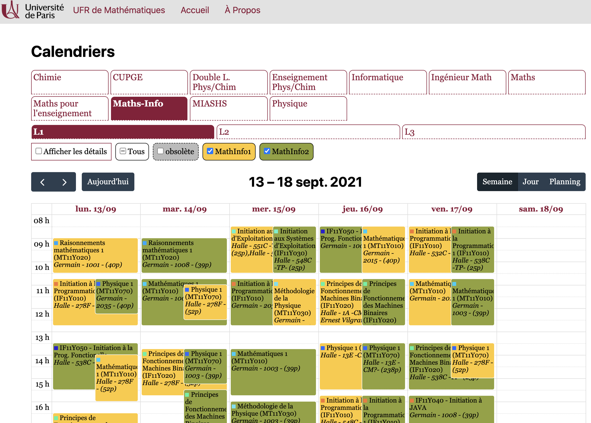

# CALENDRIER DU MASTER LOGOS

Pour qu'on ait notre propre calendrier, nous qui vivons au dépens des autres masters... 

A EXECUTER :

D'abord les installations : 

```zsh
git clone https://github.com/l-pommeret/EDT-LOGOS.git
```

```zsh
cd EDT-LOGOS
```

```zsh
pip install -r requirements
```

si sur Mac, on peut essayer :

```zsh
pip install --break-system-packages -r requirements
```

Ensuite si vous êtes en M2, vous pouvez run :

```zsh
streamlit run /Users/user/Documents/GitHub/EDT-LOGOS/edt_m2_logos.py
```

Et voilà votre calendrier ! 

Le code est une interprétation personnelle de celui de l'EdT de Paris-Cité disponible à cette adresse : https://gitlab.math.univ-paris-diderot.fr/molin/ical-ufr

# Calendriers ADE

Rendu des calendriers ADE sous forme html



https://licence.math.univ-paris-diderot.fr/informations/edt/

## Principe

### Ressources ADE

Le fichier `calendars.json` contient les codes des ressources ADE
qui nous intéressent, avec des titres et le niveau hiérarchique
`parcours/year` où ils apparaissent dans les emplois du temps. Il est utilisé pour les boutons.

Il est aussi utilisé pour le bouton `obsolète` de certaines formations. Ce bouton affiche les événements qui étaient présents dans une ancienne archive (data.28) et qui ont été supprimés ou modifiés dans le calendrier courant (data).

### Python

Ce projet nécessite ``python>=3.9``. Dans le déploiement ufr math on utilise
un environnement anaconda

```shell
conda create -n ical --file requirements.txt
```
de sorte que tous les appels ``python script.py`` peuvent être remplacés par

```shell
conda run -n ical python script.py
```

### Récupération et correction des calendriers ADE

```shell
python get_ical.py
```

- lit le fichier `formations.json`
- télécharge chaque calendrier ADE et procède à quelques fusions de calendriers.
- devine le shift temporel et le corrige et ajoute le tag pour l'heure de Paris.
- sauvegarde les fichiers `ics` dans `data/`

Un fichier par ressource ADE, nommé d'après le numéro de la ressource.

### Création d'un emploi du temps HTML

Le projet React se situe dans le dossier `src` et comprend :

- `global.css` : Styles globaux.
- `index.tsx` : Le point d'entrée pour la version "complète" de l'application.
- `bare.tsx` : La même chose mais pour une version "incrustée" où l'on n'afficherait qu'un seul calendrier pré-sélectionné.
- `config.ts`, `config.json` : Des configurations diverses.
- `types.d.ts` : Des déclarations de types globales, essentiellement pour Webpack.
- `templates/` : Dossier qui contient deux modèles HTML, un pour la version complète, un pour la version incrustée.
- `features/` : Dossier principal.

  - `ComboChoice` : Interface qui permet à un utilisateur de choisir successivement un parcours, puis une année de ce parcours.
  - `Help` : Page d'aide de l'application. L'aide elle-même se situe dans `help.md`.
  - `Layout` : La mise en page globale de l'application.
  - `ManualChoice` : Permet la sélection de groupes arbitraires à l'aide de leurs codes ADE.
  - `Calendar` : Le gros du boulot, affiche un calendrier en prenant en entrée plusieurs groupes. Contient notamment :
    - `groups.ts` : Fonctions et types utilitaires sur les groupes et les sources.
    - `GroupChooser` : Cases à cocher pour choisir quel(s) groupe(s) on veut afficher dans le calendrier.
    - `GroupsIcal` : Lien directs vers les fichiers ICal des groupes.
    - `index.tsx` : Fichier d'entrée.
    - `ModalEvent` : La boîte qui s'affiche par-dessus les autres évènements quand on clique sur l'un d'entre eux.

_Notes_ :

- Les fichiers ont l'extension `.ts`, `.tsx` car ils sont écrits en TypeScript, un sur-ensemble typé de JavaScript, et le `x` se rapporte à React. Si vous ne voulez pas utiliser TypeScript, créez vos fichiers avec l'extension `.jsx`. Si un fichier ne contient pas de React, vous pouvez l'appeler `.ts` ou `.js`.
- Les styles CSS sont dans des modules, c'est-à-dire des fichiers ayant l'extension `.module.css`. Concrètement, cela signifie qu'ils n'interagissent pas entre eux. Pour s'en servir, créez un fichier avec cette extension, puis importez-le dans un fichier `.tsx` avec :

  ```jsx
  import * as styles from "./Styles.module.css";
  ```

  et vous pourrez ensuite utiliser le style défini en l'appliquant à un élément :

  ```tsx
  return <div className={styles["maClasse"]}>...</div>;
  ```

  À noter : l'importateur convertit les casses "kebab" (`le-nom-de-ma-classe`) en casse "chameau" (`leNomDeMaClasse`).

## Composants

### Rendu html

Lancer un serveur web dans le dossier, par exemple

```
npm run start
```

et visiter http://localhost:8080 dans un navigateur.

### Choix d'affichage manuel

```
http://localhost:8080/#/manuel/6736+5638
```

### Single page

Editer le fichier `single.html` pour configurer l'emploi du temps à afficher,
et charger la page.

```
http://localhost:8080/single.html
```

## Développement

### javascript

Les fichiers source sont dans le répertoire `src`,
les fichiers produits dans `dist/` ne doivent surtout pas être
modifiés directement (générés par webpack pour inclure fullcalendar)

Pour développer, besoin d'avoir `node`

```
npm install
npm run build
```

crée les scripts
et

```
npm run start
```

lance un serveur et recompile quand les sources sont modifiées.

### Ajouter des formations

Le fichier `calendars.json`
Contient les groupes via leurs codes sur ADE. Ce fichier gère les boutons.
Exemple de syntaxe:

```

    { "code": 6598  , "title": "MiashsEco1"  , "label": "ECO1"        , "parcours": "miashs"   , "year": "l2"}  ,
    { "code": 6599  , "title": "MiashsEco2"  , "label": "ECO2"        , "parcours": "miashs"   , "year": "l2"}  ,
    { "code": 6600  , "title": "MiashsEco3"  , "label": "ECO3"        , "parcours": "miashs"   , "year": "l2"}  ,
    { "code": 6601  , "title": "MiashsHisto" , "label": "Histoire" , "parcours": "miashs"   , "year": "l2"}  ,
    { "code": 6602  , "title": "MiashsSocio" , "label": "Sociologie"    , "parcours": "miashs"   , "year": "l2"}  ,
    { "code": 6603  , "title": "MiashsGéog"  , "label": "Géographie"      , "parcours": "miashs"   , "year": "l2"}  ,
    { "code": 6604  , "title": "MiashsLingu" , "label": "Linguistique"     , "parcours": "miashs"   , "year": "l2"}

```

il est utilisé pour les boutons.

Mais ces groupes sont souvent inclus sur ADE dans une année de formation qui a un autre code.
Parfois certaines reservations communes aux groupes sont saisies sur le code de la formation.

Il existe donc un fichier qui gère les téléchargements:

`formations.json`

qui regroupe les codes des formations, et les codes des fiches qu'elle contient.
Ainsi au telechargement du calendrier d'un groupe, on ajoute toujours celui de la formation.

Exemple de syntaxe:

```
    { "code": 6593, "title": "L2Miashs", "fiches": "6598,6599,6600,6601,6602,6603,6604"}

```

alors les calendriers 6593,6598 sont téléchargés, fusionnés et enregistré sous le nom de 6598. Puis idem avec 6593 et 6599,...
