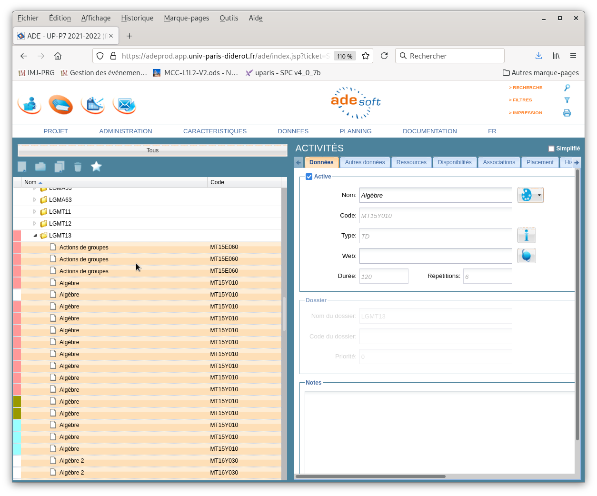

# toolspogee

Ce dossier contient quelques scripts et fichiers utilisés pour créer le fichier
`codesapogee.py`.

Les fichiers de ce dossier ne sont pas directement utilisés par `get_ical.py`, seul `codesapogee.py`. compte.

## Les .csv

Il faut en première colonne le titre exact tel qu'il est saisi dans ADE (le meme que dans apogée).
Cette chaine doit etre unique dans le .csv, donc il vaut mieux trier les lignes.
en seconde colonne le code apogée. Si vous avez deux même titre dans des années différentes, il faudra faire plusieurs fichiers, si vous avec deux même titre dans une même année alors il ne faut en mettre aucun.

Les .csv utilisés ont été crées à partir des pdf obtenus n imprimant dans ADE.

### Possibilité de créer un pdf/html via ADE

Aller dans Données>Ressources, puis selectionnez les ressources voulues en faisant afficher leur code apogée et imprimez dans un pdf:

cela n'est pas grave si vous avez des doublons du moment qu'ils ont le même code.

Ensuite comme dans `mkcsvfrompdf.txt`, on peut créer le .csv à partir du .pdf. (NB: il y a 2 lignes par fichier pdf à traiter)

## La création des dictionnaires: `mkcodesapogee.py`

Une fois le que l'on a un .csv, on peut s'en servir dans `mkcodesapogee.py` pour créer un dictionnaire par fiche. (Trouver la liste des fiches voulues dans `formations.json`.)
